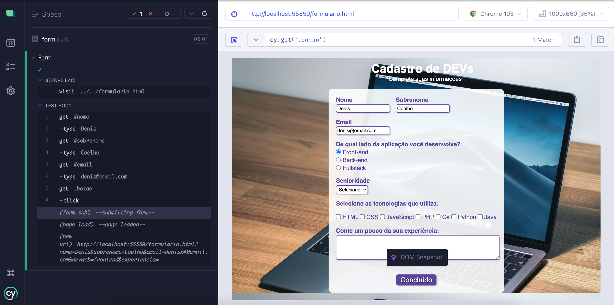

# Cypress Form

<h1 align="center">
    
</h1>

## Projeto

Projeto desenvolvido para estudos utilizando Cypress

## Funcionalidades

- [x] Preenchimento dos campos
- [x] Validação dos campos
- [x] Screenshot para validação visual

## Tecnologias

Este projeto foi desenvolvido utilizando as seguintes tecnologias:

- [x] Cypress
- [x] Javascript
- [x] MochaJs
- [x] ChaiJs

## Instalação e uso

Clone o repositório

```bash
git clone https://github.com/deniscoelho-js/cypress-form.git

```

Siga os passos abaixo

```bash
# Instale as dependências
$ npm i or yarn

# Rodar os testes
$ npx cypress open
```
